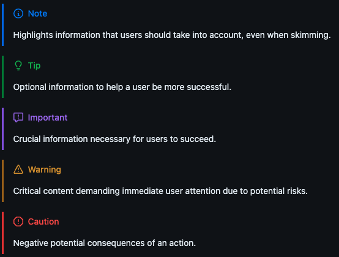

Github Markdown Cheatsheet
==========================

Text Formatting
---------------

Official Documentation can be found in the `Github Docs <https://docs.github.com/en/get-started/writing-on-github/getting-started-with-writing-and-formatting-on-github/basic-writing-and-formatting-syntax>`_

=============   ======================      =========================================   ==================================================
Formatting      Markdown                    Example                                     Output
=============   ======================      =========================================   ==================================================
Bold            ``** **`` or ``__ __``      ``**This is bold text**``                   **This is bold text**
Italics         ``* *`` or ``_ _``          ``_This text is italicized_``               *This text is italicized*
Strikethrough   ``~~ ~~``                   ``~~This was mistaken text~~``              T̶h̶i̶s̶ ̶w̶a̶s̶ ̶m̶i̶s̶t̶a̶k̶e̶n̶ ̶t̶e̶x̶t̶
Subscript       `` ``            ``This is a subscript text``     This is a :sub:`subscript` text
Superscript     `` ``            ``This is a superscript text``   This is a :sup:`superscript` text
=============   ======================      =========================================   ==================================================

Callouts
--------

Documentation on this feature can be found `here <https://github.com/orgs/community/discussions/16925>`_

.. code::

    [!NOTE]  
    Highlights information that users should take into account, even when skimming.

    [!TIP]
    Optional information to help a user be more successful.

    [!IMPORTANT]  
    Crucial information necessary for users to succeed.

    [!WARNING]  
    Critical content demanding immediate user attention due to potential risks.

    [!CAUTION]
    Negative potential consequences of an action.
