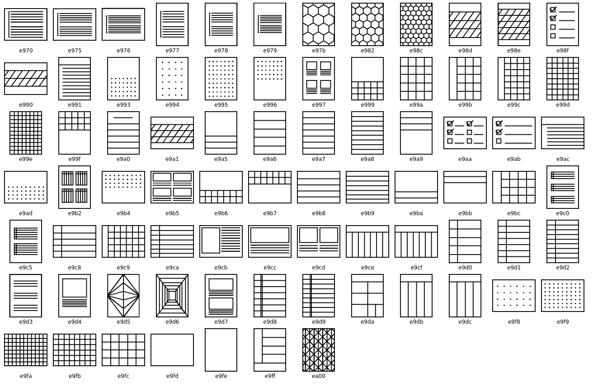

Remarkable2
===========

Remarkable does not officially support custom templates. When you sync documents to your remarkable app you will NOT see your custom templates. If you email the document from your remarkable2 to yourself, it will contain the template. Also after your Remarkable2 installs any updates, your custom templates may disappear and need to be reinstalled. 

Templates should be created as a png with the resolution of 1404 × 1872 px. 

Managing Custom Templates
-------------------------

The easiest way to manage custom templates is to use the `templatectl <https://github.com/PeterGrace/templatectl>`_. 

To Install ``templatectl``
__________________________

1. Go to the `release page <https://github.com/PeterGrace/templatectl/releases>`_ of the repo, and download the ``templatectl`` file to your machine. 

2. You then want to upload this file to your remarkable2 tablet. You can use scp to do this 
``scp templatectl root@<IP Address of your Remarkable2>:/home/root/.``

Adding New Templates
____________________

1. Upload your Templates to your remarkable2 tablet

``scp <TEMPLATE>.png root@<IP of Remarkable2>:/usr/share/remarkable/templates/.``

2. SSH to your Remarkable2 table

``ssh root@<IP of Remarkable2>``

3. Run the ``templatectl`` command to import the template you uploaded. An example of this would be for a template file named ``ICS-214_pg1.png``

``./templatectl add -c Custom -f templates/ICS-214_pg1.png -i e9a0 -n ICS-214_pg1``

4. Restart your Remarkable2 tablet, or restart the ``xochitl`` service.

``systemctl restart xochitl``

Icon Codes
__________

Here is a quick reference for the default Icon Codes used by templates on the Remarkable2 tablets

